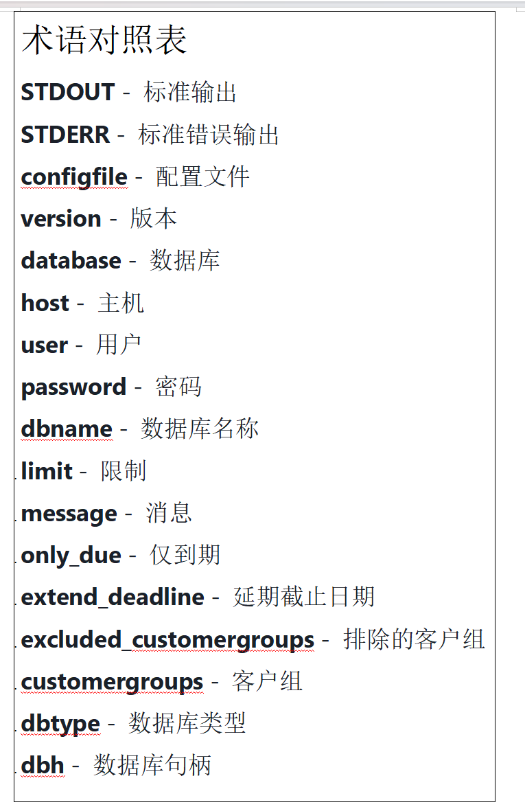

# 局域网管理系统（LMS）
LMS（局域网管理系统）是一套全面的应用程序套件，专为局域网的管理而设计。其主要目标是为客户提供最佳服务，大型互联网服务提供商（ISP）便是其典型代表。LMS 使用 PHP、Perl 和 C 编程语言开发，并支持 MySQL 或 PostgreSQL 作为数据库后端。当前的功能集包括：客户数据库（存储姓名、地址、电话号码、备注等）、用于跟踪计算机的库存系统（IP 和 MAC 地址）、专为网络运营定制的精简财务系统（包括财务余额、发票和电子邮件通知）、自动计费计划、生成各种配置文件的能力（例如，ipchains/iptables 防火墙脚本、DHCP 守护进程配置、bind 的 DNS 区域文件、/etc/ethers 条目、oident、htb 设置等）、按主机显示带宽使用情况、请求跟踪系统（帮助台功能）以及日程安排组织者。<!--梁冰丽 著>
# LMS 项目背景
LMS（本地网络管理系统）是一款专为企业、学校、政府机构及其他局域网环境设计的综合管理工具，旨在提高局域网的运维效率、保障网络安全并优化资源分配。通过集中管理、实时监控以及对局域网内设备、用户、流量和权限的智能控制得以实现。<!--梁冰丽著>

# 未来发展趋势
- 人工智能集成：利用机器学习算法预测流量高峰，并动态调整网络策略以实现最佳性能。
- 云边协同：与云管理平台结合，实现跨区域局域网的统一治理。
- 物联网扩展：支持新兴终端设备的连接与管理，包括 5G 和 LoRa 技术。
- 自动化运维：通过故障解决的自愈脚本减少人工干预。<!--梁冰丽 著>

# 详细安装步骤:
-   以下是安装LMS系统的一般步骤，具体细节可能因您选择的LMS平台(如Moodle、Canvas、Blackboard等)而有所不同。

    通用安装准备
        1.系统要求检查
-       Web服务器(Apache/Nginx/IIS)
-       数据库(MySQL/MariaDB/PostgreSQL)
-       PHP (特定版本，根据LMS要求)
-       必要的PHP扩展

        2.获取LMS软件
-       从官方网站下载最新稳定版
-       或通过Git克隆项目仓库

详细安装步骤
1. 环境配置
    bash
    # 以Linux系统为例
    sudo apt update
    sudo apt install apache2 mysql-server php libapache2-mod-php php-mysql php-xml php-curl php-zip php-gd php-mbstring

2. 数据库设置
    sql
    CREATE DATABASE lmsdb CHARACTER SET utf8mb4 COLLATE utf8mb4_unicode_ci;
    CREATE USER 'lmsuser'@'localhost' IDENTIFIED BY 'securepassword';
    GRANT ALL PRIVILEGES ON lmsdb.* TO 'lmsuser'@'localhost';
    FLUSH PRIVILEGES;

3. 安装LMS核心文件
    bash
    # 解压或克隆到web目录
    cd /var/www/html
    sudo unzip lms.zip
    # 或
    sudo git clone https://github.com/lms-project/lms.git

4. 设置文件权限
    bash
    sudo chown -R www-data:www-data /var/www/html/lms
    sudo chmod -R 755 /var/www/html/lms

5. 通过Web界面完成安装
-       访问 http://yourserver/lms
-       按照安装向导步骤操作
-       提供数据库连接信息
-       设置管理员账户
-       完成初始配置     <!--王玥 著>

## 📮 主要功能 & 截图
一、 设备管理
功能描述：
1. 自动设备发现：通过ARP扫描和SNMP协议自动识别局域网内的设备（计算机、打印机、物联网设备等）。
2. 设备分类和标签：按类型（终端/服务器/物联网）、部门和位置自动分类，支持自定义标签。
3. IP/MAC地址绑定：防止非法设备接入，支持静态绑定和动态分配策略。
4. 设备状态监控：实时显示设备在线/离线状态、操作系统、开放端口等信息。
二、 流量监控和分析
功能描述：
1. 实时流量监控：显示设备/IP的上传/下载速度和带宽使用排名。
2. 历史流量统计：按天/周/月生成流量趋势图表，并支持导出到Excel。
3. 流量限制策略：为设备或组设置带宽限制，并支持优先级控制（如优先控制视频会议流量）。
4. 协议分析：识别HTTP/HTTPS、FTP和游戏等协议的比例，并阻止非法协议。
三、 访问控制和安全
功能描述：
1. 黑名单规则：基于IP/MAC地址、端口和协议设置访问权限。
2. VLAN分区：将不同部门/设备隔离到独立的VLAN中，增强网络安全。
3. 防火墙联动：与现有防火墙集成，自动拦截非法设备或异常流量。
4. 网络拓扑图：可视化设备连接关系，快速定位故障节点。
四、 告警和通知
功能描述：
1. 异常告警：设备离线、流量超限、非法访问等事件触发告警。
2. 通知方式：通过邮件、短信、微信、Webhook等多种渠道推送通知。
3. 告警阈值设置：自定义流量阈值（如带宽使用率超过90%持续5分钟）。
五、 可视化和报表
功能描述：
1. 仪表盘面板：汇总设备状态、流量和告警等核心数据。
2. 自定义报表：生成设备清单、流量报表和安全审计日志。
3. 网络拓扑图：支持拖拽编辑拓扑，支持导入背景图片（如机房布局）。
六、 权限管理和审计
功能描述：
1. 多角色权限：对管理员、操作人员和审计员进行分级权限控制。
2. 操作日志：记录设备配置修改、策略调整等操作，支持追溯。
3. 远程维护：通过Web界面重启设备并执行命令（需支持SSH/RDP）。
七、 扩展和集成
功能描述：
1. API接口：提供RESTful API，可与Zabbix、Prometheus等第三方系统集成。
2. 插件市场：支持安装第三方插件（如DDNS和流量整形工具）。
3. 多平台支持：兼容Windows/Linux/macOS，并支持Docker部署。<!--by 韦思宇-->

#项目主要功能截图

这个文件 docgen.sh 是一个 Bash 脚本，主要功能是根据传入的参数（html、txt 或 all），自动从 SGML 源文件生成不同格式的文档（HTML 或纯文本）。它会调用 jade 和 lynx 等工具，将 SGML 文件转换为 HTML 或 TXT 格式，并将生成的文件移动到指定目录或重命名。脚本支持三种用法：

html：生成 HTML 格式文档
txt：生成纯文本格式文档
all：同时生成 HTML 和纯文本文档
如果参数不正确，会输出用法提示。

【项目主要功能截图】
![Main functional images/2205308030301-1.png
]<!--李金艳 著>

该项目（LMS，可能为“LAN Management System”或“Local Management System”）的主要功能是管理和生成与 VoIP（如 Asterisk 语音交换系统）相关的配置文件，自动化电信系统的配置过程。
下面分别说明主要功能和核心代码：

主要功能
自动生成 Asterisk 配置文件
通过读取数据库中的 VoIP 账号、电话号码、紧急号码等信息，自动生成 Asterisk 所需的 SIP 和分机配置文件（如 sip-lms.conf、extensions-lms-incoming.conf、extensions-lms-outgoing.conf），用于电话系统的自动化部署和管理。

配置管理
支持通过命令行参数指定配置文件、输出详细信息、选择配置节等，便于灵活集成和运维。

数据库集成
通过数据库获取账号、号码、权限等信息，实现与业务系统的无缝对接。
所以
本项目的核心是自动化生成和管理 Asterisk（开源电话系统）所需的配置文件，结合数据库和配置文件，实现电信系统的集中化、自动化管理。
主要代码集中在读取配置、数据库、生成配置文件等自动化流程

【项目主要功能截图】
![Main functional images/2205308030301-2.png
]<!--李金艳 著>

该项目（LMS，LAN Management System）主要用于电信业务自动化管理，特别是与 VoIP（如 Asterisk）系统集成。其核心功能涵盖了电话系统配置、话单计费、应急号码管理等。
主要功能
自动生成 Asterisk 配置文件
通过数据库信息自动生成 SIP 账号和分机拨号规则配置文件，实现电话系统自动化部署和管理。<!--李金艳 著>

话单（CDR）计费与导入
支持从文件或标准输入批量导入通话详单（CDR），并写入数据库，实现自动计费和账单管理。

应急号码（Emergency Numbers）管理
通过解析 TERYT（波兰行政区划）数据和应急号码 CSV 文件，自动将应急号码与地理区域关联并导入数据库，便于后续呼叫路由和合规管理。<!--李金艳 著>

命令行工具与配置管理
所有脚本均支持命令行参数，灵活指定配置文件、操作类型、输入方式等，便于自动化运维。<!--李金艳 著>

主要代码结构与核心逻辑
1. 应急号码导入（lms-teryt-emergency-numbers.php）
功能：
将 TERYT 行政区划和应急号码 CSV 文件解析后，自动匹配行政区、区、乡镇等信息，并将应急号码写入数据库表 voip_emergency_numbers。

【项目主要功能截图】
![Main functional images/2205308030301-3.png
]<!--李金艳 著>

2. 话单计费与导入（lms-billing.php）
功能：
批量导入通话详单（CDR），或估算主叫和被叫的最大可通话时长。

【项目主要功能截图】
![Main functional images/2205308030301-4.png
]<!--李金艳 著>

3. Asterisk 配置生成（lms-asterisk.php）
功能：
自动生成 SIP 账号和分机拨号规则配置文件，便于电话系统自动化部署。

【项目主要功能截图】
![Main functional images/2205308030301-5.png
]<!--李金艳 著>

 脚本用于批量导入现金流水（如银行对账单、缴费记录等）到LMS系统数据库。它支持从指定文件或标准输入读取数据，通过配置的正则表达式模式（patterns）解析内容，自动识别和导入各类收款记录，并可根据配置自动提交入库。适用于财务自动对账、批量充值等场景。

【项目主要功能截图】
![Main functional images/2205308030301-6.png
]

主要功能
本项目（LMS，LAN Management System）中的 lms-smstools-delivery-report.php 脚本用于处理短信网关（如 SMSTools）发送回执文件，自动更新数据库中短信发送状态。
其主要流程为：

解析命令行参数，获取配置文件和短信回执文件路径。
读取并解析短信回执文件，提取短信ID、状态、时间戳、手机号等信息。
查询数据库中对应的短信发送记录。
根据回执内容自动更新数据库中短信的状态（如已送达、失败等）。
【项目主要功能截图】
![Main functional images/2205308030301-7.png
]

主要功能
script-options.php 是 LMS 系统所有命令行脚本的通用参数解析与环境初始化模块。
其主要功能包括：

统一解析命令行参数（支持长短参数、必选/可选参数、参数校验等）。
自动加载配置文件（如 lms.ini），并定义全局目录常量（如 SYS_DIR、LIB_DIR、MODULES_DIR 等）。
初始化数据库连接 $DB，加载 Composer 自动加载器和 LMS 基础库。
支持 --help、--version、--quiet 等通用参数，自动输出帮助和版本信息。
兼容 HTTP 模式和 CLI 模式，适配不同运行环境。

【项目主要功能截图】
![Main functional images/2205308030301-8.png
]

主要功能
本文件 cashimportcfg-id75.php 是 LMS 系统现金流水批量导入功能的自定义解析配置。
它的作用是为 lms-cashimport.php 脚本提供正则表达式和字段映射规则，使系统能够自动识别和导入特定格式的银行对账单或缴费流水数据。

主要功能包括：

定义每一行数据的正则匹配模式（pattern）。
指定各字段（如客户ID、金额、日期、备注等）在匹配结果中的位置。
定义日期、客户ID、发票号等的二次正则提取规则。
支持数据编码转换、金额修正、备注内容替换等。
支持通过整行哈希去重。

【项目主要功能截图】
![Main functional images/2205308030301-9.png
]

主要功能
本项目 authLMS.php 是为 MediaWiki 提供的LMS系统用户认证插件，实现 MediaWiki 用户通过 LMS 系统的账号密码进行登录认证。
主要功能包括：

让 MediaWiki 使用 LMS 系统的用户数据库进行认证（单点登录）。
支持 LMS 用户的密码校验、IP/主机限制、有效期限制等。
自动同步 LMS 用户的昵称、邮箱等信息到 MediaWiki 用户资料。
禁止在 MediaWiki 本地修改密码或创建新账号，所有用户管理均在 LMS 系统完成。

【项目主要功能截图】
![Main functional images/2205308030301-10.png
]<!--李金艳 著>

主要功能
本文件 [lib/backend/class.LocationCache.php]class.LocationCache.php ) 是 LMS 系统的地理位置数据缓存与查询类。
其主要功能是：

高效缓存和查询城市、街道、建筑等地理信息，减少数据库访问次数，提高性能。
支持两种加载策略（全部加载/按需加载），适应不同规模的数据量和内存需求。
提供通过ID、标识符等多种方式获取城市、街道、建筑等信息的接口。

主要功能
本文件 ConfigContainer.php 是 LMS 系统的配置分区容器类，用于管理和操作多个配置分区（section），实现配置的分组、批量添加、查询、子分区筛选等功能。
主要功能包括：

存储和管理多个配置分区（ConfigSection 对象）。
支持添加单个或多个配置分区。
支持按名称获取分区、判断分区是否存在。
支持获取某分区下的所有子分区。

主要功能
本文件 IniConfigProvider.php 是 LMS 系统的INI 配置文件读取适配器，实现了 ConfigProviderInterface，用于从指定的 INI 文件加载系统配置，并以数组形式返回。
主要功能包括：

按需加载指定路径的 INI 配置文件（支持自定义路径）。
作为配置容器的底层数据提供者，为系统其它配置管理类提供原始配置数据。

主要功能
本文件 LMSCustomerManagerInterface.php 是 LMS 系统的客户管理接口定义，用于规范所有客户管理相关操作的实现。
其主要功能是：

统一定义客户管理相关的所有方法（如获取客户信息、联系方式、账务、地址、同意书、外部ID、呼叫记录等）。
便于不同实现类（如数据库实现、Mock实现等）遵循同一接口，保证系统可扩展性和可维护性。
支持客户的增删改查、状态变更、同意书管理、外部ID管理、呼叫管理等全方位操作

主要功能
本文件 LMSDocumentManager.php 是 LMS 系统的文档管理器，负责系统中所有与文档（如发票、合同、通知等）相关的操作。
主要功能包括：

获取客户文档列表、文档详情、附件、归档文档等。
管理文档编号方案（NumberPlan），如获取、添加、更新、删除编号方案。
文档的归档、发布、删除、权限复制等操作。
文档的邮件/SMS 通知发送、附件管理、查重等。
支持文档的多种筛选、权限校验、批量操作等。

项目术语表（中英文对照表）
【这里是图片】

markdown
<!--李金艳 著>

项目术语表（中英文对照表）
【这里是图片!】

markdown
<!--李金艳 著>

#小组分工
1. 英文版 README.md - 项目介绍撰写者：梁冰丽
。 负责撰写英文版 README.md 和中文版 README.zh.md中项目介绍部分，包括项目背景、目标和功能概述。
。确保内容简洁明了、逻辑清晰，使用专业的英文表达。完成初稿后，使用 AI 审核专业术语。
。 在撰写内容中按要求添加作者注释标识（如）。
。 至少提交2次，每次 commit message 描述清楚提交内容，且每次贡献的Changes 数量不少于10行。
2. 英文版 README.md和中文版 README.zh.md- 安装/部署说明撰写者：王玥
。 编写英文版 README.md 中的安装/部署说明部分，详细列出项目所需的依赖环境、安装步骤和部署万法。
对每一步骤进行清晰的描述，可适当添加截图辅助理解。完成后用 AI审核专业术语，保证内容准确无误。
。 在对应内容添加作者注释标识（如）。
。 保证至少 2次有效提交，每次提交的Changes 数量符合要求。
3. 英文版 README.md和中文版 README.zh.md- 项目主要功能介绍加截图撰写者（含截图）：
。 负责撰写英文版 README.md 和中文版 README.zh.md中带截图主要功能的使用教程部分。操作项目主要功能，记录操作步骤并截取关键界面截图。
根据截图撰写详细的使用教程，用AI审核专业术语，使教程内容易懂。在内容中添加作者注释标识（如）。
。 按要求完成至少 2次有效提交。
4.项目术语表制作者：李金艳
。 收集项目中涉及的专业术语，制作中英文对照的术语表（terms.md），术语数量不少于5个。
。 对每个术语进行准确的中英文翻译，可借助 AI工具辅助，但需人工审核确认。
。 保证术语表内容格式规范、清晰易读
5. 中文版 README.zh.md 翻译与润色者：李金艳，梁冰丽，王玥，韦思宇
。 使用AI辅助将英文版 README.md 翻译为中文版 README.zh.md，翻译完成后进行细致润色，确保中文表达自然流畅、准确传达原文意思。
。 检查并修正 Al 翻译可能出现的错误或不当表述。在翻译内容中保留原作者注释标识。
。 至少提交 2次翻译与润色后的内容，每次提交保证足够的工作量。
6. AI 使用文档撰写者与截图整理者：李金艳，梁冰丽，王玥，韦思宇
。 撰写使用文档，对每位小组成员使用AI辅助的工作进行简要说明，包括使用的AI工具、应用场景和目的等。
。 整理小组成员的 AI使用过程截图，按照学号_文件编号的格式命名（如 2023001_1jpg），统一存放至 ai_usage_screenshots 文件夹。
。 检查截图是否符合要求（JPG 或 PNG 格式），保证截图清晰、能展示提问过程。
至少提交2次整理后的结果。<!--李金艳 著>
